<center>qg中期考核的学习笔记</center>

K-means,KNN,Linear_regression,Logistic_regression,BP-network是之前已经稍微摸了一下的，当时也记了详细的笔记。所以梳理了一下就拿来用了，所以这几个算法的笔记，笔记风格可能会和SVM，决策树等有些不同，前者潇洒一点，后者不管是写的还是看的可能都更辛苦一点，还请见谅。

同时为了追求完成算法的数量，有些算法并没有完全达到要求，只是把算法的给做出来了，其他的配套没有做好。我的朴素贝叶斯都没能往上放呢。。

这次考核学到的东西比以前都多，而且认识到自己真的有点菜的要命了。一想到自己可能还进不了工作室或者进不了QG就更加焦虑了。算法不稳定是个比较普遍的现象。像K_means和SVM，有时候单次运行的结果就明显就不对的，还要多运行几下。

# K_means

### 原理

1. 从样本中随机选取k个样本作为簇中心，然后就是要计算每一个实例点与每一个簇中心的距离（这里我们使用欧式距离），然后根据距离越小越相似的原则，将实例点归为最近的簇中心的那一类。

2. 那么经过这一轮后实例点已经划分到k个直到不同的簇中，接着我们要重新计算簇中心的位置。每个簇中多多少少都会有实例，我们根据簇中的实例计算平均值，将这个平均值作为这个簇中心，直到全部簇中心都更新完。

3. 接着就是重新划分每一个实例点是属于哪一个簇，计算方法还是一样，根据距离决定属于这些新的簇中的哪一个。就这样不断的循环更新实例所属的簇和簇中心。

4. 评定循环停止的标志：达到迭代的最大次数或者是簇中心位置已经保持不变了。也就是经过多次更新后的簇中心已经达到属于这个簇中实例的平均值所决定的位置，且簇内的实例也不在改变了。

    

### 程序框架

#### 框架

```python
    def __init__(self, n_clusters=3, max_iter=300):

        self.centroids = None
        self.n_clusters = n_clusters
        self.max_iter = max_iter
        self.clusterAssment = None
        self.labels = None
        self.sse = None
```

初始化的时候，首先我们想到的是要设置好簇的个数，即n_clusters，那么紧跟着的，这些簇是在特征空间中的，我们也要为簇在特征空间做准备，即是centroids。

max_iter是为了保证不会出现没完没了的聚类，clusterAssment设定的是聚类评估，labels是返回聚类的成果的，对输入的数据集，K-means把它聚类到哪类。

sse是簇内误差平方和，类似于一个评判模型吧。

***

```python
    def _randCent(self, X, k):
        n = X.shape[1]
        centroids = empty((k, n))
        for j in range(n):
            minJ = min(X[:, j])
            rangeJ = float(max(X[:, j]) - minJ)
            centroids[:, j] = (minJ + rangeJ * random.rand(k, 1)).flatten()
        return centroids
```

_randCent（）就是为了生成随机点的，我们需要保证一开始生成的随机点在特征空间中。首先`centroids = empty((k, n))`需要理解，拿我在jupyter中做的例子，n是数据集的列数，对饮的就是数据集有多少个特征，k就是聚类的数量。这样组成一个空的矩阵，最起码向量的维数和数量是符合要求的了。

然后就是填充数值，这么怎么说都好la，看懂之后不是很难。flatten是numpy.ndarray.flatten的一个函数，即返回一个一维数组。**只能适用于numpy对象**，即array或者mat，普通的list列表不适用！

我被这个搞得死去活来，这个[]真的是折杀人，附上一篇[链接](https://www.cnblogs.com/yvonnes/p/10020926.html).

***

fit()我挑一些枝干内容记录一下好了。

```python
m = X.shape[0]
# m*2的矩阵，第一列存储样本点所属的族的索引值，第二列存储该点与所属族的质心的距离
self.clusterAssment = empty((m, 2))
```

取出数据集的行数，拼成一个m*2的矩阵，这个 矩阵的第一列用来记录离每行样本最近的那个簇是哪一类的，第二列用来记录簇中心到该样本的距离。

```python
# 最多运行max_iter次，多次随机化，可能使得聚类性能提高
for _ in range(self.max_iter):
    clusterChanged = False
     # 将每个样本点分配到离它最近的质心所属的族
        for i in range(m): 
            minDist = inf
            minIndex = -1
            for j in range(self.n_clusters):
                distJI = self._distEclud(self.centroids[j, :], X[i, :])
                if distJI < minDist:
                   minDist = distJI
                   minIndex = j
             if self.clusterAssment[i, 0] != minIndex:
                   clusterChanged = True
                   self.clusterAssment[i, :] = minIndex, minDist ** 2
                
        # 若所有样本点所属的族都不改变,则已收敛，结束迭代
        if not clusterChanged:  
                break
         # 更新质心，即将每个族中的点的均值作为质心
        for i in range(self.n_clusters): 
                ptsInClust = X[nonzero(self.clusterAssment[:, 0] == i)[0]]  
       		    self.centroids[i, :] = mean(ptsInClust, axis=0)
                
        self.labels = self.clusterAssment[:, 0]
        self.sse = sum(self.clusterAssment[:, 1])
        return self
```

​	其实看代码就蛮清楚的了，那几个大的for循环的逻辑虽然嵌套了几层，但还是很好懂的。

```python
for i in range(self.n_clusters): 
     ptsInClust = X[nonzero(self.clusterAssment[:, 0] == i)[0]]  
     self.centroids[i, :] = mean(ptsInClust, axis=0)
```

​	就是这个`X[nonzero(self.clusterAssment[:, 0] == i)[0]]` 有点厉害，要好好掰扯掰扯。

`self.clusterAssment[:, 0] == i`取出了所有行的第零个数据，也就是取出了它们最近的簇的类型，然后用nonzero取出了这些点的索引，

它的返回值是一个长度为a.ndim(数组a的轴数)的元组，元组的每个元素都是一个整数数组，其值为非零元素的下标在对应轴上的值。

返回的索引值数组是一个2维tuple数组，该tuple数组中包含一维的array数组。其中，一维array向量的个数与a的维数是一致的。

然后我们再取出它们的[0]，作为X的索引值


#### 以后可以做的优化

二分K_means估计是没时间做了的，K_means的聚类学习曲线估计也没时间做。但是可以先简单的记一下,这个东西能帮助我们决定k要大概怎么取好

```python
def kclearningCurve(dataSet, cluster=kMeans,k=10):
    n = dataSet.shape[1]
    SSE = []
    for i in range(1,k):
        centroids, result_set = cluster(dataSet, i+1)
        SSE.append(result_set.iloc[:,n].sum())
    plt.plot(range(2,k+1),SSE,'--o')
    return SSE
```


### 数据集的划分

把iris数据集的前两个特征取出来方便可视化，然后用scatter来直观展示聚类效果，并用sklearn的Calinski-Harabaz Index作为评判指标。


### 结果评估

K_means多次运行的结果并不一样，聚类结果为3时sse大概在四百到五百，偶尔有聚类效果明显很差的情况。当聚类个数为2时sse明显飙升。sklearn的K_means的Calinski-Harabaz Index比我的K_means只略大一些。可能在面对更加复杂的数据集时，sklearn的K_means能提供更好的稳定性和速度吧。


# KNN

### 原理

近朱者赤，近墨者黑


### 程序框架

关于KNN的类，大体上会这样实现。

```python
class KNN(object):

# 设置k为默认3，__init__可以用来导入参数，给属性赋值
    def __init__(self,k=3):
        self.k=k

# 这个函数就是训练方法
    def fit(self,x,y):
        self.x = x
        self.y = y

# 用这个函数来计算任意两个向量间的距离（欧氏距离）
    def _square_distance(self,v1,v2):
        return np.sum(np.square(v1-v2))
           
# 用这个函数来做预测
    def predict(self,x):

# 再关注一下精度怎么样
    def score(self,y_true=None,y_pred=None):
```


### 随手记

argsort()就是用来排序的，对一个数组从小到大进行排序，但是它返回的是排序后结果的索引

`nearest = np.argsort(distances)`

截取了前k个元素之后，它会返回一个列表，那么这个列表里面某一类的元素可能是最多的，我们需要那个类作为knn的算法模型。

```python
topK_y = [y_train[i] for i in nearest[:k]]
```

那么怎么取呢，就最好用Counter，不过Counter返回的东西大概长这个样子{A:proportion of A,B:proportion of B,…}这样的键值对构成的。相当于A 有proportion of A这么多票，B同理。

然后用most_common(1)就取得票数最多的元素，但是most_common()返回的是个列表，以元组为单位，因为要考虑到会有取两位三位更多位的情况嘛，所以需要列表进行封装。然后再用[0]取得第一个元组，再用一次[0]取得元组中的第一个元素，就是票数最多的类。

```python
from collections import Counter

votes = Counter(topK_y)

return votes.most_common(1)[0][0]
```

### 来点优化

哎，但是我写到一半觉得不能这样，要来点优化。我想要对距离分配权重，也就是说这次knn算法我就统一用加权投票法来处理距离好了。

一方面要给自己加一点点点难度，另一方面这个样本的比例差距实在是有点大，分配了权重之后可能准确度会更令人满意一些。也就是上面的Counter我就不用了。

此外，好像变量数越多时，欧式距离的区分能力就会越差，那到时候，可能还要改改。

#### 距离加权

感谢这位博主的[博客](https://blog.csdn.net/weixin_41770169/article/details/81560946)，就是没有把代码写出来~~白嫖失败~~，啊还要感谢师姐2333

权重，我使用的是高斯函数。这个在距离为0的时候权重为1，随着距离增大，权重减少，但不会变为0。因为在k中，肯定有更多的样本的label是没有违规的，我需要降低它们的权重。

```python
def gaussian(dist, a=1, b=0, c=0.3):
	return a * math.e ** (-(dist - b) ** 2 / (2 * c ** 2))
```

我需要定义一个”概率“的东西。

```
1.加权kNN首先获得经过排序的距离值，再取距离最近的k个元素。

2.在处理离散型数据时，将这k个数据用权重区别对待，预测结果与第n个数据的label相同的概率：

3.将各个类预测的权重值相加，哪个类最大，就属于哪个类。

4.f(x) = Wi属于类x / Wi总和      i=1,2,...,k
```

#### 寻找最好的K

我们怎么选择超参数啊，那只能实验了。

```python
best_score = 0.0
besk_k = -1
for i in range(1,11):
    knn_clf = KNNClassifier(k=i)
    knn_clf.fit(X_train, y_train)
    score = knn_clf.score(X_test, y_test)
    if score > best_score：
    	best_k = k
        best_score = score
print("best_k = ",best_k)
print("best_score ="，best_score)
```


### 数据集的划分

使用自己.train_test_split()，将iris划分成了训练集和测试集，八二开。训练集“训练”模型，用测试集计算准确率。


### 结果评估

自己的knn准确率比sklearn的略高，当然是因为sklearn的knn我没有开距离加权。同时寻找合理的k能提高准确率，这一点也体现出来了。

# Linear_regression

### 原理

用直线来拟合数据之间的关系，具体涉及到微积分和线性代数了。而且也不是很难，懒得写了。


**数学基础**：向量化运算 正规方程法

简单线性回归的数学证明方式并不困难，二元微积分求极值而已。数学上的基础回顾有更高的要求，$y=ax+b$只有一个特征，我们是不是可以延申到多个特征？

“**微积分不可能只局限于处理实数到实数的函数**，当研究问题的维度，自由度增加，向量化是一种自然的选择。“这是我当时给自己提的醒。

向量化运算好像是个与之对接的接口，虽然我之前只知道向量化运算可以提高运算性能，anyway(oﾟvﾟ)ノ

只从微积分的角度来说，多元的角度和二元没什么区别。这当然是数学抽象的魅力，但还有另外一个非常有意思的方法——**正规方程**。我还被线性代数的解释惊艳到了，这个值得专门好好写一篇笔记。在这里也只是提个醒先叭，没准还可以用这种方法来实现算法。~~我才不填这个坑呢~~


### 程序框架

#### 简单线性回归

```python
class SimpleLinearRegression:

    def __init__(self):
        self.a_ = None
        self.b_ = None

    # 最小二乘法的实现
    def fit(self, x_train, y_train):
	
    # 预测向量
    def predict(self, x_predict):
       
	# 预测单个样本
    def _predict(self, x_single):
        return self.a_ * x_single + self.b_

    # 评判标准
    def score(self, x_test, y_test):
        y_predict = self.predict(x_test)
        return R_square(y_predict, y_test)

    def __repr__(self):
        return "SimpleLinearRegression()"
```

#### 线性回归

这个要不还是稍微提一嘴。？要不还是算了吧我懒hhh

```python
class LinearRegression:

    def __init__(self):
        self.coef_ = None  # coefficient:系数
        self.interception_ = None  # interception:截距
        self._theta = None

    # 我大·正规化方法必须拥有姓名！
    def fit_normal(self, X_train, y_train):

        assert X_train.shape[0] == y_train.shape[0], "the size of X_train must be equal to the size of y_train"

        X_b = np.hstack([np.ones((len(X_train), 1)), X_train])
        self._theta = np.linalg.inv(X_b.T.dot(X_b)).dot(X_b.T).dot(y_train)
        self.interception_ = self._theta[0]
        self.coef_ = self._theta[1:]

        return self

    # 梯度下降法是更加普适的方法啦，所以就直接叫fit了
    def fit(self, X_train, y_train, eta=0.01, n_iters=1e4):


    def gradient_descent(self, X_b, y, initial_theta, eta, n_iters=1e4, epsilon=1e-8):
       

    # 代价函数其实就是mse啦
    def J(self, theta, X_b, y):
        try:
            return np.sum((y - X_b.dot(theta)) ** 2) / len(X_b)
        except:
            # 如果return没有成功，说明代价函数过大，可能是学习率太大导致梯度无限上升
            return float('inf')

    def dJ(self, theta, X_b, y):
        return X_b.T.dot(X_b.dot(theta) - y) * 2. / len(X_b)

    def predict(self, X_predict):

    def score(self, X_test, y_test):

    def __repr__(self):
        return "LinearRegression()"
```


### 来点优化

**向量化运算**

我们之前的$a = \frac{\sum\limits_{i=1}^m(x^{(i)}-\overline{x})(y^{(i)}-\overline{y})}{\sum\limits_{i=1}^m(x^{(i)}-\overline{x})^2}$~~哇这公式输入真的累死人~~。是这个样子的，如果我们把$(x^{(i)}-\overline{x})$设为$w^{(i)}$,把$(y^{(i)}-\overline{y})$设为$v^{(i)}$，那$a$的式子就会有了一个更好的表达方式，我们再让$w=(w^{(1),...w^{(m)}})$（v同理），那么分子就变成了$w·v$,也就是**点乘**。就会有很好的数学工具给我们用，运算效率就快。

```python
num = 0.0
d = 0.0
for x, y in zip(x_train,y_train):
    num += (x - x_mean)*(y - y_mean)
    d += (x - x_mean) ** 2
```

对于之前的for循环，我们这里要怎么改呢。

```python
# 进行点乘
num = (x_train - x_mean).dot(y_train - y_mean)
# emmm，点乘
d = (x_train - x_mean).dot(x_train - x_mean)
```

其他的都不用变。

补充了一个正规化方法算不算优化啊。

### 数据集的划分

使用自己.train_test_split()，将iris划分成了训练集和测试集，八二开。训练集“训练”模型，用测试集计算准确率。


### 结果评估

#### 稍微介绍一下R方

分类问题的预测就是一个概率，不管在什么示例里面都是0~1之间的一个数。但是无论用上面的哪种指标，你在衡量房价预测准确度的时候可能单位是万，在衡量学生成绩的时候可能就是更小的单位，比如说“分”了。这样如果我们希望**跨越不同示例**来比较模型的优略，我们就还需要一个新的指标。

R Squared（也可直接叫R方）我们有

$R^2=1-\dfrac{SS_{residual}}{SS_{total}}$emmm，其实它的计算式就是$R^2=1-\dfrac{\sum\limits_{i=1}(\hat{y}^{(i)}-{y}^{(i)})^2}{\sum\limits_{i=1}(\overline{y}-{y}^{(i)})^2}$。这个复杂的分子就是使用我们的模型预测产生的错误，这个分母是使用$y=\overline{y}$进行预测产生的错误。相比于朴素或者说无脑的分母预测方式，分子的预测方式是更加妥帖的，它最起码有考虑x和y的关系，所以可以想到分子产生的错误是比分母产生的错误要多的。也就是说，虽然它产生了一些错误，但是它也减少了一些错误。**拿1减去这个比值，那么就相当于是这个模型拟合准确了的数据的比例。**

如果这个$R^2$等于0，就说明我们的模型应该是基准模型，如果$R^2<0$，说明我们学习到的模型还不如基准模型，此时，**很有可能我们的数据不存在任何线性关系。**


用简单线性回归去拟合的时候就发现这个$R^2$是负数，我的多元线性回归和sklearn的线性回归的$R^2$效果就是一样的。

# Decision_tree

感谢《机器学习实战》，和这篇[博客](https://cuijiahua.com/blog/2017/11/ml_2_decision_tree_1.html)的讲解。

决策树是一种非参数学习算法，所谓参数学习算法，就是假设可以最大程度地简化学习过程，与此同时也限制可以学习到的东西是什么的那类算法，简化为一个函数形式，通过确定参数来拟合数据。

与之对应的非参数算法，就不对目标函数的形式做出强烈假设，它们可以从训练数据中自由地学习任何函数形式，像KNN，SVM，emmm可能神经网络也是这样叭，就比较灵活。

决策树需要解决的核心问题是每个节点在哪个维度上做划分，某个维度在哪个值上面做划分

### 背景知识（ID3）

信息熵，熵在信息论中代表随机变量的不确定度，计算方式就是$l(x_i)=-logp(x_i)$，其中$p(x_i)$是选择该类的概率，对数其实以2或者以e为底都可，下面就都以2来示意了。

当熵中的概率由统计得到的时候，所对应的熵称为经验熵。我们定义训练数据集D，则训练数据集D的经验熵为H(D)，|D|表示其样本容量，及样本个数。设有K个类Ck, = 1,2,3,...,K,|Ck|为属于类Ck的样本个数，因此经验熵公式就可以写为 ：$H(D)=-\sum \limits_{k=1}^K\frac{|C_k|}{|D|}log_2\frac{|C_k|}{|D|}$

我们希望在某一个节点上的某一个阈值划分之后信息的阈值降到最低，也就是让信息熵最低。信息熵，就是我们的评判指标。

### 原理与流程

构建一颗决策树的流程可以概括为三个步骤，**特征选择**，**决策树的生成**，**决策树的修剪**。这里先做一棵小小的分类树。

#### 特征选择

如果利用一个特征进行分类的结果与随即分类的结果没有很大差别，拿着这个特征就没有分类能力，我们就不想要这种特征。通常特征选择的标准是信息增益或者信息增益比。所谓信息增益就是在划分数据集之后信息发生的变化。特征对最终的分类结果影响也就越大，我们就应该选择对最终分类结果影响最大的那个特征作为我们的分类特征。

在了解信息增益的定义之前，我们还要进一步的了解一个条件熵的概念，条件熵H(Y|X)表示**在已知随机变量X的条件下随机变量Y的不确定性**。

​			$H(Y|X)=\sum \limits_{i=1}^np_iH(Y|X=x_i)$

信息增益是相对于特征而言的。所以，特征A对训练数据集D的信息增益g(D,A)，定义为集合D的经验熵H(D)与特征A给定条件下D的经验条件熵H(D|A)之差，即：

​			$g(D,A)=H(D)-H(D|A)$

很直观的概念，我们想看在已知某一个条件下，数据的不确定性降低了多少。

设特征A有n个不同的取值{a1,a2,···,an}，根据特征A的取值将D划分为n个子集{D1,D2，···,Dn}，|Di|为Di的样本个数。记子集Di中属于Ck的样本的集合为Dik，即Dik = Di ∩ Ck，|Dik|为Dik的样本个数。于是经验条件熵的公式可以些为：

​			$H(D|A)=\sum \limits_{i=1}^n\frac{|D_i|}{|D|}H(D_i)=-\sum \limits_{i=1}^n\frac{|D_i|}{|D|}\sum \limits_{k=1}^K\frac{|D_{ik}|}{|D_i|}log_2\frac{|D_{ik}|}{|D_i|}$

那么，现在知道了怎么计算经验熵和条件上，我们就可以计算出信息增益了。

#### 决策树生成和修剪

我们已经学习了从数据集构造决策树算法所需要的子功能模块，包括经验熵的计算和最优特征的选择。

由于特征值可能多于两个，因此可能存在大于两个分支的数据集划分。第一次划分之后，数据集被向下传递到树的分支的下一个结点。在这个结点上，我们可以再次划分数据。因此我们可以采用**递归**的原则处理数据集。

决策树生成算法递归地产生决策树，直到不能继续下去未为止。这样产生的树往往对训练数据的分类很准确，但对未知的测试数据的分类却没有那么准确，即出现**过拟合**现象。过拟合的原因在于学习时过多地考虑如何提高对训练数据的正确分类，从而构建出过于复杂的决策树。解决这个问题的办法是考虑决策树的复杂度，对已生成的决策树进行简化。

### 程序框架

这次使用决策树，来预测隐形眼镜的类型。眼镜的类型有三种，分为hard,soft,和no lense，也就是硬软材质以及不适合佩戴隐形眼镜。

一共有24组数据，数据的Labels依次是`age`、`prescript`、`astigmatic`、`tearRate`、`class`，也就是第一列是年龄，第二列是症状，第三列是是否散光，第四列是眼泪数量，第五列是最终的分类标签。

哦豁！我发现好像师兄已经帮忙把数据处理好了，太nice了。

```
fit()函数的大概会这么实现：

检测数据集中的每一个子项是否属于同一分类：
	if so return 类标签：
	Else
		寻找划分数据集最好的特征
		划分数据集
		创建分支节点
			for 每个划分的子集
				调用函数fit()并增加返回结果到分支节点中
		return 分支节点
```

### 数据集的划分

只是，都把它们拿进去训练了，然后看看有没有预测出来我想要的。

~~不应该这么划分的，但不管了。~~

# Naive_bayes

### 原理


### 程序框架


### 结果评估


# Logistic_regression

### 原理

听上去像是一个回归算法，为什么是解决分类问题的？这是因为它把样本的特征和样本发生的概率联系起来了。比如病性肿瘤的概率预测出来恶性的可能性是0.7的话，那我们可能就把它的肿瘤分到恶性的类中去了。在推广开之前，我们只能用它解决二分类的问题。

所以底子是由回归打的，所以线性回归，多项式回归都可以上。但这样不能保证$\hat{y}=\theta^T·x$输出的数在0\~1之间(那样就不是概率了)。为了保证这个对接，我们再用一个函数$\sigma(t)=\dfrac{1}{1+e^{-t}}$导一下，我们就把输出值压缩到0~1之间了。我们规定，这个输出值就是它的概率。

总结一下，就是$\hat{p}=\sigma(\theta^T·x)=\dfrac{1}{1+e^{-\theta^T·x}}$。当$\hat{p}$大于等于0.5的时候，我们就预测其为1类，否则预测其为0类。

**代价函数：**

这个东西乍一想可能比方差什么的难规定一些，但是逻辑是差不多的。我们抓住$\hat{p}$和$y$（也就是具体的类，只能是0或者1嘛）之间的差距，如果如果这个差距越小，比如一个东西是1类，你预测它是1类的可能性是0.9。那么就越准。我们用这个样子的形式去规定我们的代价函数。

$cost=-ylog(\hat{p})-(1-y)log(1-\hat{p})$

以什么为底其实不太重要，关键是图像的走势。

上面的表达式都是针对一个样本的，$J(\theta)$只需要将所有的cost累加然后除以总量m即可得到平均的代价函数。

$J(\theta)=-\dfrac{\sum\limits_{i=1}^my^{(i)}log(\sigma(X_b^{(i)}\theta))+(1-y^{(i)})log(1-\sigma(X_b^{(i)}\theta)}{m}$

这个函数没有解析式，也就是说我们没有公式可以直接套进去算出函数的最小值，也就是说我们只能**用梯度下降法来求解**了。也正是因为这个原因，我们在众多可以表达预测准确度的函数表达式中选择了这个，因为它是一个下凸函数，也就是说只有全局最优解。很合适用梯度下降法。它的导函数$\dfrac{J(\theta)}{\theta_j}=\dfrac{\sum\limits_{i=1}^my^{(i)}(\sigma(X_b^{(i)}\theta)-y^{(i)})X_j^{(i)}}{m}$推导起来挺繁琐的，就直接用好了。

所以我们就很方便的有$\bigtriangledown J(\theta)=\begin{equation}\left( \begin{array}{c}\partial J/\partial \theta_0\\\partial J/\partial\theta_1\\...\\J/\partial\theta_n\end{array}\right)\end{equation}$因为在编程的时候我们希望计算操作是向量化的，所以再给出它的向量化公式$\bigtriangledown J(\theta)=\dfrac{X^T_b·(\sigma(X_b\theta)-y)}{m}$

### 程序框架

```python
class LogisticRegression:
    def __init__(self):
        # coefficients: 系数
        self.coef_ = None
        # intercept：截距
        self.intercept_ = None
        self._theta = None

    def _sigmoid(self, t):
        return 1. / (1. + np.exp(-t))

    def fit(self, X_train, y_train, eta=0.01, n_iters=1e4):

        X_b = np.hstack([np.ones((len(X_train), 1)), X_train])
        initial_theta = np.zeros(X_b.shape[1])
        self._theta = self.gradient_descent(X_b, y_train, initial_theta, eta, n_iters)
        self.intercept_ = self._theta[0]
        self.coef_ = self._theta[1:]

        return self

    # 辅助进行梯度下降法
    def J(self, theta, X_b, y):
      
    def dJ(self, theta, X_b, y):
     
    def gradient_descent(self, X_b, y, initial_theta, eta, n_iters=1e4, epsilon=1e-8):
        return theta

    def predict_proba(self, X_predict):
     
    def predict(self, X_predict):

    def score(self, X_test, y_test):
        
    # 这个用来画RP曲线的，不用管  
    def decision_fuction(self, X_predict):
      
    def __repr__(self):
        return "LogisticRegression()"
```

### 数据集的划分

adult数据集没有成功的搞下来，于是就退而求其次转为使用digits数据集了。

```python
digits = datasets.load_digits()
X = digits.data
y = digits.target.copy()

# 手动把数据集调得不平衡一些
y[digits.target==9] = 1
y[digits.target!=9] = 0
```

### 结果评估

无论是准确率，召回率，精准率还是F1-score都稳定在0.9左右的样子，同时PR曲线也很形象的展现了阈值为0的时候差不多是最优的。


# BP_network

我一开始以为可以直接套我之前实现的憨憨BP，但是后来发现不对劲。我之前的BP是自己生成随机数据来着的，但是这次是要识别手写数字。所以我套用我之前学习的3Blue1Brown的[神经网络系列](https://www.bilibili.com/video/BV16x411V7Qg?t=587&p=2),以及他所推荐的这个[大神的教程](https://hit-scir.gitbooks.io/neural-networks-and-deep-learning-zh_cn/content/)，把它搞了下来。

对BP的认知算有两大来源吧，第一是自己看的博客和视频，像3Blue1Brown之类的。第二个就是对照着源代码来看的，就像之前实现的BP和这次，~~意思就是这次我基本上是照抄了2333~~

显然，原理部分不太想再黏贴下去了。上下标的表示又丑又长，要想得到简单的结论，有时候我们不得不这么做。~~但我决定不做~~

### 初探的困惑

虽然本来就是如此，但是还是有点烦。

前三个的方法不敢说都懂了，但是好歹也观其大略了一下，哪怕到后面一点我才意识到可能需要更多的多元微积分的背景（和统计学）才能理解得更深刻。但我对这三个东西的继续学习是挺乐观的。

反观神经网络就不太一样，虽然我大概知道发生了什么，但是我对每一步具体达成了什么效果，神经网络为什么好，依旧不甚清楚。

比如**为什么在反向传播神经网络中必须使用非线性激活函数**？

说是——引入非线性因素，使得神经网络可以任意逼近任何非线性函数，这样神经网络就可以应用到众多的非线性模型中，emmm不是太懂。但好歹知道了不总是sigmoid函数。

再比如**神经网络是怎么实现把代价函数的值给降下来的？反向传播不用的就是梯度下降吗，那我们要神经网络干什么，它们有什么区别**？

说是——传统方法不方便计算偏导？但链式法则不也是很传统的东西吗，anyway

这些问题问出来不见得很有价值，也不是很快就能解决的，但是这是很自然产生的困惑。

### 再探

现在回答初探的困惑（没错，初探的困惑是我寒假的时候学习时留下的问题）

原因是一个看上去很简单的理由，就只要是线性组合，不管你组合多少次，最终的效果都可以由一个线性组合等效出来。数学的表达就是矩阵乘法，不管中间乘多少下，最终出来的都只是一个矩阵。进一步的说，如果不引入非线性的元素，你的取值就只局限在那个线性空间里面了。所以势必要引入非线性元素，突破当前空间（开始中二），才能达到任意逼近一个函数的可能。

### 基础回顾:

**它能做什么:**

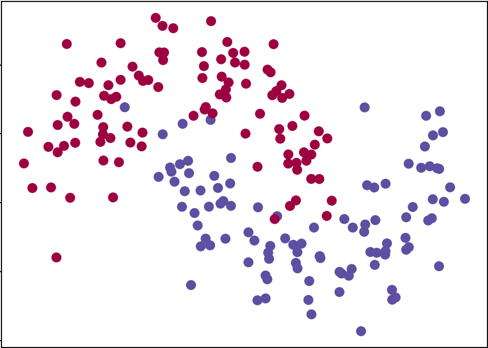

能训练一个分类器,这个分类器根据x和y的值预测正确的类别,注意这个数据不是**线性可分离**的,我们无法绘制一个能很好的将两个类别分开的直线(你确实可以用直线尽可能地把数据分开，但是无法捕获数据的月牙形状)。 

这意味着除非我手动设计对给定数据集有效的非线性特征(比如说多项式),否则线性分类器将无法拟合数据。

而这就是神经网络的**主要优势**之一,我们不需要设定这些东西,神经网络的隐藏层将为我们学习这些特征。 

**神经元模型:**

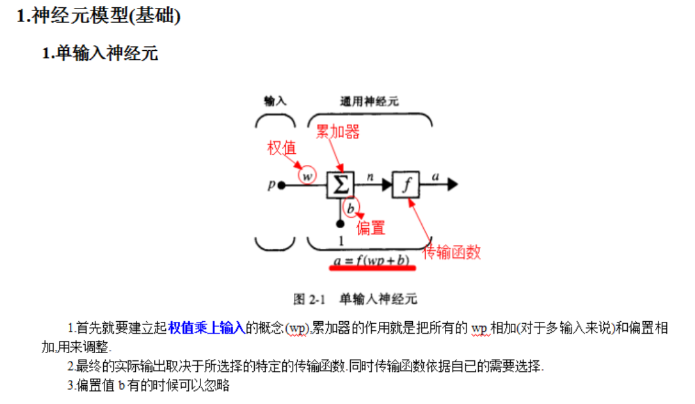


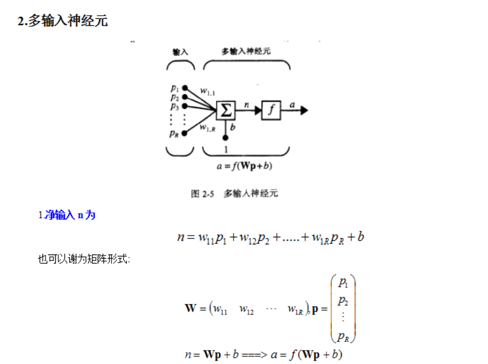

好吧，还是需要上下标的。还是记一下

**上下标的含义:**对于$w^{(i)}_{jk}$,我们应当这么解读,它是表示从$l-1$层的第k个神经元到第$l$层第j个神经元之间的权重。比如下面这幅图就是第2层的第4个元素到第三层的第二个元素之间的权重。 

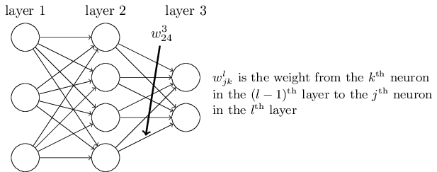

一开始会觉得这种表述很麻烦，这种表述的奇怪之处在于它的$j,k$这样的下标。一开始我觉得用$j$表示输入神经元，用$k$表示输出神经元更加合理。但并不是这样的。

我们用$b^l_j$ 表示第l层第j个神经元的偏置，用$a^l_j$第l层第j个神经元的激活值。那么这个等式就是成立的。

$a^l_j=\sigma(\sum_mw^l_{jk}a_k^{l-1}+b_j^l)$

向量化啊向量化啊

$a^l_j=\sigma(w^la^{l-1}+b^l)$


### Python2->python3

大佬编写他的教程时用的是Python2，在转嫁到Python3的时候遇上了一些问题，要记录一下，主要来源于这个[博客](https://blog.csdn.net/ygjustgo/article/details/79873768),此外还有一点其他的小问题，我一开始也碰上了这位[博主](https://blog.csdn.net/qq_37764129/article/details/89488367)所遇到的问题，但是这么修改过后是没有用的，我还又套了一层range(),根据这篇[博客](https://blog.csdn.net/dong198645/article/details/102371313?depth_1-utm_source=distribute.pc_relevant.none-task-blog-BlogCommendFromBaidu-4&utm_source=distribute.pc_relevant.none-task-blog-BlogCommendFromBaidu-4)的建议。能运行是能运行了，但是那个显示效果不是很理想。所以我又想着怎么改一改。绕了一下还是写len(training_data)就够了，也就是说再次运行的时候上面的问题就都不知道怎么的就都解决了。

**mnist_loader：**

​	这里主要的问题就是要改为import pickle，之前的那个Cpickle已经被弃用了。然后下面的三个zip()的外面得多套一层list()

​	这一个文件是把mnist_loader转化为待输入的特征的，28*28 = 748 ，也就是输入层有748个小圆圈。我就把它当成一个黑箱好了。

### 程序框架

#### 随机梯度下降

这种想法就是通过随机选取小量输入样本来计算出一个梯度，然后就开始冲冲冲了。采取少量样本的平均值可以快速地得到梯度，这会加速梯度下降过程，进而加速学习过程。虽然无法保证这个“梯度”是最优秀的梯度，但是人家走的快。

要交了,文档一时半会写不完了。什么时候自己再补上吧。


### 数据集的划分

MNIST 数据集可以分为两个部分。第一个部分包含了 60,000 个用于训练的图像。这些图像是扫描了 250 个人的手写数字得到的，他们之中一半是来自美国人口普查局的员工，另一半是高中生。这些图像是 28 乘 28 个像素点灰度图像。

MNIST 的第二个部分是 10,000 个用于测试的图像，它们同样也是 28 乘 28 的灰度图像。我们将会用这些测试数据去评估我们的神经网络的识别效果。为了保证测试结果的准确性，这些测试数据是采样于另一个_不同的_250人的样本（尽管这些人也是美国人口普查局的员工和高中生）。这保证了我们的系统能够识别训练集之外的手写数字图像。

我们将测试集保持原样，但是将60,000个图像的MNIST训练集分成两个部分：一部分50,000个图像，我们将用来训练我们的神经网络，和一个单独的10,000个图像的*验证集（validation set）*。

### 结果评估

```
Epoch 0: 9099 / 10000
Epoch 1: 9231 / 10000
Epoch 2: 9344 / 10000
Epoch 3: 9360 / 10000

...

Epoch 25: 9488 / 10000
Epoch 26: 9527 / 10000
Epoch 27: 9523 / 10000
Epoch 28: 9518 / 10000
Epoch 29: 9528 / 10000
```

能看到准确率是在上升的。


# SVM

艹（一种植物），如果我不是要打十个我真的不想碰SVM，这是个巨坑。

十分感谢[大海老师](https://space.bilibili.com/453472000)对于SVM数学原理的详细讲解。

这些[博客](https://blog.csdn.net/yzcjwddbdgg/article/details/86304027?depth_1-utm_source=distribute.pc_relevant.none-task-blog-OPENSEARCH-1&utm_source=distribute.pc_relevant.none-task-blog-OPENSEARCH-1)也真真是极好的，当然也少不了我大[知乎](https://zhuanlan.zhihu.com/p/29212107)。

### 由简至繁的三个层面

1：线性可分：耿直憨憨

2：近似线性可分：差不多向量机先生

3：非线性支持：当数据线性不可分时，通过使用核技巧以及软间隔最大化，实现非线性的分类器。

emmm，这一次先把SVM阉割到近似线性可分就差不多了吧。。我知道非线性支持是最诱人的奈何我菜啊。。

至于多分类，我还是省省吧(ノへ￣、)


### 学习动机

~~我反复地对比了一下我的描述和大佬的描述，这个语言的差距不是一般的大~~

我们再来感性的回顾一下逻辑回归，逻辑回归的训练出一条决策边界。如果决策边界的一侧是A类的话，那么另外一侧就是非A类。

决策边界可能有很多条，我们希望找到一个泛化能力最强的决策边界。

关于怎么提高泛化能力，除了正则化，我们还有一个简单的想法，就是在满足训练集的众多决策边界中，找到一条决策边界，它的特性是**平均来说距离两个类别最近的样本最远。**那这样的决策边界泛化能力肯定就不比其他决策边界差了。SVM就是把对泛化能力的考量放到了算法内部。这个就是我们学习SVM的动机，它试图提高模型的泛化能力。


### 数学原理

#### 开始前再唠叨两句

首先解释一下什么是支持向量吧，为了最好的那个决策边界，我们需要有两个基准的决策边界，这两个决策边界定义了一个区域，这个区域内不会再有任何的数据点，SVM最终得到的决策边界就在这个区域之间，可能还是最中间。我们把”把区域划分开来的”那些**样本点**叫做支持向量，或者是支撑向量，这就是中文翻译名的由来。算法的整个过程，也是围绕着支持向量展开。

两个支持向量之间的”距离“是就是margin，最终的决策边界到两个决策边界的距离都是d。那么，大概的说，SVM要做的事情的关键就是**最大化margin**。（因为我们还没有严谨地定义margin是什么嘛），也就是被转化为了一个求解效用函数最大值的问题。

这种方法的求最值只适合凸函数。

***

所以，我们简单的思路是先探讨怎么进行硬分类，在这个探讨的过程中梳理，再学习一下数学原理。

#### 怎么描述距离

(x,y)到Ax+By+C=0的距离，我们可以这么描述

​				$distance=\frac{\left|Ax+By+C\right|}{\sqrt(A^2+B^2)}$																（1）

我们把它拓展到**n维空间**，就有x到$w^Tx+b=0$								

​				$distance=\frac{\left|w^Tx+b\right|}{\left\|w\right\|}$																		(2)

其中，b就是截距，w就是权值。

在我们知道了怎么求点到直线距离之后，我们就要把它带到SVM的应用场景里来了，我再解释一下这是怎么带的。事实上$w^Tx+b=0$就是一个决策边界，在这里，w就是法向量，它决定了决策边界的方向，b就是位移量，它决定了决策边界，或者说超平面到原点的距离。满足$w^Tx+b=0$的所有x套进去，就绘制出了决策边界。

#### SVM想要什么

##### 1.首先确定决策边界

基于我们对SVM的感性认识，我们希望不管是正类也好，还是负类也好，所有的样本到决策边界的距离的绝对值都大于d，所以有下面的这一组式子。SVM**首先**希望做种的效果能同时满足(3),(4)式，是吧，你先得找到一条能满足训练集的决策边界，再考虑泛化能力的问题。

​				$\frac{\left|w^Tx^{(i)}+b\right|}{\left\|w\right\|d}\geq 1$				$\forall y^{(i)}=1$											 （3）

​				$\frac{\left|w^Tx^{(i)}+b\right|}{\left\|w\right\|d}\leq 1$				$\forall y^{(i)}=-1$										  （4）

##### 1.2对方程进行化简

我们之前对y的分类是1类和0类划分的，其实怎么划分都好，只是划分为1和-1可以把3式和4式整合为一个式子，我们用sign（）函数来这么取值。你看——

​				$y^{(i)}(w^Tx^{(i)}+b) \geq 1$															     （5）

那么，SVM就是希望所有的点都满足这个式子了。

##### 2.找到”最好“的决策边界

允许我提醒你一下，我在上面规定了d是支持向量到最终我们选择的决策边界的距离。最好的决策边界到支持向量的距离最大，也就是说我们要最大化下面这个式子，这里的x，就应该是某一个支持向量。

也就是说，我们要max$\frac{\left|w^Tx+b\right|}{\left\|w\right\|}$																	(6)

对应上面，就是最大化margin。

但是事实上，分母的预测结果的绝对值一直是1来着，所以最后相当于是最小化分母

最终，我们要min$\left\|w\right\|$																				（7）

一般最小化的目标不是(7)式，而是$\frac{1}{2}\left\|w\right\|^2$												 (8)

这样方便求导操作。

##### 总结

SVM的数学原理，到最后就是一个有约束条件的求极值问题。

约束条件是（5）式：$y^{(i)}(w^Tx^{(i)}+b)-1 \geq 0$

欲求极值是（8）式：$\frac{1}{2}\left\|w\right\|^2$

#### 怎么求极值

其实高数下的拉格朗日法已经接触过等式约束条件下求最优解的思路了。这里只是简单的提一嘴它的几何含义，假定$x$是$d$维向量，那么目标函数就是在由方程$g(x)=0$所确定的$d-1$维曲面上寻找一个能使得目标函数求得最值的点，在那点处，两个函数的梯度是“共线”的，所以就存在一个常数，使得两者梯度某种程度上的相加等于零。解释得并不清楚，但是我要强调拉格朗日法也是有几何直观的理解方式的。

关键是**不等式约束条件下的最优化条件**。这里需要补充一下**KKT条件**，因为KKT条件将Lagrange乘数法(Lagrange multipliers)所处理涉及等式的约束优化问题推广至不等式，这也是支持向量机所需要的数学背景。

emmm，首先给一篇[知乎笔记](https://zhuanlan.zhihu.com/p/38163970),写得很清晰，我这里就简单地分析一下思路就好。

在保证$g(x) \leq 0$的前提下，求目标函数$f(x)$的最小值。设$f(x)$最小值的解为$x_0$好了，分两类情况——

**第一类**就是$g(x_0)<0$，也就是解在约束条件的内部。那么我们其实就不需要约束条件了，问题就转化为了无条件极值问题。

**第二类**就是且只能是$g(x_0)=0$了，$f(x)$的最小值可能明明能取到$x_1$，但是$x_1$不在约束域内部，所以只能被动得把最小值点拉回到约束域，这个拖动越小越好，所以$x_0$只能在边界上。那如果是这样问题就转化为了等式约束条件下的最优化问题，也就是可以使用拉格朗日乘数法来解决了。

具体的条件我就不罗列了。懂得都懂（捂嘴）

#### Soft_Margin

上面是一些很基本的想法，但是这里的想法有个很严重的问题，那就是它对于异常点是相当敏感的，而这个敏感会严重影响我们对泛化能力的追求。甚至有些情况下，类型之间可能是线性不可分的。我们希望，SVM做出来的模型，对那些不能反映整体样本分布规律的样本睁一只眼闭一只眼，也就是给它一点容错性。而这个就是Soft_Margin想要解决的问题，也是我们学习Soft_Margin的动机。

再回顾一下这一组式子，实际上，可以很直观的感觉到，我们只要把约束条件式弱化一点，就达到我们想要的效果了。

***

约束方程：$y^{(i)}(w^Tx^{(i)}+b)- 1 \geq 0$

目标方程：$\frac{1}{2}\left\|w\right\|^2$

***

弱化版约束方程：$y^{(i)}(w^Tx^{(i)}+b) \geq 1-\zeta_{(i)}$

对于每一个样本，我们都会给它分配一个$\zeta_{(i)}$，也就是容错空间。

对于这个$\zeta_{(i)}$要求大于0，这样点到决策边界的距离的要求就没有那么大了，如果小于0的话那这个条件就更加严格了。如果拎不清的话就再回到上面看看（3）,（4）式。但是这个$\zeta_{(i)}$又不能太大，如果容错容忍度无穷大的话，那么分类和不分类就没有区别了，因此，我们也需要一个约束条件限制一下这个$\zeta_{(i)}$,让它不能无限的大。那我们改进一下目标方程就好了。

弱化版目标方程：$\frac{1}{2}\left\|w\right\|^2+C\sum\limits_{i=1}^m\zeta_{(i)}$

上面就是L1正则，既然两者是加在一起的，那我们就可以通过一个常数C来平衡两者对结果影响程度的比例了。如C=1，那么两者就是同等重要的，如果C>1，那么就是优化后半部分为主。在这里，C就是一个新的超参数了。

**Sort_margin总结：**

约束方程：$y^{(i)}(w^Tx^{(i)}+b) \geq 1-\zeta_{(i)}$

目标方程：$\frac{1}{2}\left\|w\right\|^2+C\sum\limits_{i=1}^m\zeta_{(i)}$ （求最小值）

至此，线性SVM的原理就差不多学习了个大概吧。

#### 核函数

估计是写不到的，先挖个坑吧。

非线性的问题在无限维的时候是线性可分的。

你在把低维特征映射到高维的时候，其实没有必要真的把高维的函数给算出来，有一个点积和结果是等效的。哎就胡乱记两笔。

#### 实现

难顶，本来以为可以开始搓了。但是发现自己的数学还差了亿点点。接着填坑吧。

上面我们已经知道了目标函数和约束条件，我们还是拿硬分类的数学来继续学习，~~大不了我就不实现Sort_margin了~~

min $f(x)=\frac{1}{2}\left\|w\right\|^2$

s.t. $g_{(i)}(x)=1-y_i(w^Tx_i+b) \leq0(i=1...m)$

转化为拉格朗日的形式就是

$L(w,b,\alpha)=\frac{1}{2}\left\|w\right\|^2+\sum\limits_{i=1}^m\alpha_i(1-y_i(w^Tx_i+b))$	$(\alpha_i \geq0)$

清点一下未知数，我们需要求w和b，此外还多了一个$\alpha$,更准确一点的来说，是求L取最小值时的w和b。

回顾求极值的条件，我们是希望有$\sum\limits_{i=1}^m\alpha_ig(x)=0$的，只有这样L才能取得极小值，这是一个必要条件。

但是这个有点不现实，因为在这个具体的函数中，$\alpha_i\geq0$且$g(x)\leq0$,也就是说，对于所有的

$\alpha g(x)$，最大值就是0，就感觉有点苛刻，但苛刻也没办法吖，那总得有点“虽不能至，心向往之”的精神吧，也就是当$\alpha g(x)$取得最大值的时候，我们有可能有L取得最小值。

***

我现在的水平能只能很不深刻的认识到我的表述是多么的不严谨，大体上这与梯度下降的过程有点像，哎懂的都懂(再次捂脸)

***

也就是找到$\alpha$使得后面那一项最大，才能使得w和b最小。

$Min_{w,b} L(w,b,\alpha)=min_{w}\frac{1}{2}\left\|w\right\|^2+max_{\alpha}\sum\limits_{i=1}^m\alpha_i(1-y_i(w^Tx_i+b))$

$=min_{w,b}max_\alpha(\frac{1}{2}\left\|w\right\|^2+\sum\limits_{i=1}^m\alpha_i(1-y_i(w^Tx_i+b)))$

#### 对偶问题

上面那个式子很难顶啊，是吧，我们要引入一下**对偶问题**的概念，辅助我们后面继续进行化简了。

对于原问题的求解$mix_xmax_{\alpha,\beta}L(x,\alpha,\beta)$，我们可以通过求解它的对偶问题$mix_{\alpha,\beta}max_xL(x,\alpha,\beta)$来获得解答，这里有一个不等关系：

$mix_xmax_{\alpha,\beta}L(x,\alpha,\beta) \geq mix_{\alpha,\beta}max_xL(x,\alpha,\beta)$

我们称它为弱对偶条件。

那与之对应的就有强对偶条件，那么两者之间就是相等关系了，那什么时候满足强对偶条件呢。

①：原问题是凸函数，就是没有局部最优解的那种很好看的函数

②：$g(x)$是线性约束，就是像$ax+b$之类的线性关系作为约束条件

③：满足KKT条件

满足这三个就是强对偶关系了，现在①和②都是满足的，那我们再加入③的条件，$L(x,\alpha,\beta)$就满足强对偶关系了。

哎，本来是不想罗列KKT条件的，但是这有助于我下一步的数学推导的笔记，还是记一下吧。

#### SVM中的KKT条件

​			1.$\alpha_i \geq0$

​			2.$1-y_i(w^Tx_i+b) \leq0$

​			3.$\alpha_i(1-y_i(w^Tx_i+b))=0$

​			4.$\frac{\part L}{\part w}=0;\frac{\part L}{\part b}=0$

​	这些都是对原方程的制约条件，都是要带进去的。带入解得

$\frac{\part L}{\part w}=w-\sum\limits_{i=1}^m\alpha_iy_ix_i=0$		——>带入拉格朗日函数，可以把w给消掉

$\frac{\part L}{\part b}=-\sum\limits_{i=1}^m\alpha_iy_i=0$


（以防我忘了，我再copy一下）

$L(w,b,\alpha)=\frac{1}{2}\left\|w\right\|^2+\sum\limits_{i=1}^m\alpha_i(1-y_i(w^Tx_i+b))$

**整理得：**$L(w,b,\alpha)=\frac{1}{2}(\sum\limits_{i=1}^m\alpha_iy_ix_i)^T(\sum\limits_{i=1}^m\alpha_iy_ix_i)+\sum\limits_{i=1}^m\alpha_i-\sum\limits_{i=1}^m\alpha_iy_i(\sum\limits_{i=1}^m\alpha_iy_ix_i)^Tx_i-\sum\limits_{i=1}^m\alpha_iy_ib$

注意到我们有$\sum\limits_{i=1}^m\alpha_iy_i=0$的噢，带进去再化简得——

$L(w,b,\alpha)=\sum\limits_{i=1}^m\alpha_i-\frac{1}{2}\sum\limits_{i=1}^m\sum\limits_{j=1}^m\alpha_iy_i\alpha_jy_jx_i^Tx_j$

哇，真是好简单了呢（绝望）。最起码没有w和b了，我们只需要想办法，使得$\alpha$最大就可以了，这就是原问题的对偶问题的转化。

### 目标函数推导太长不看版

绝了，学了那么老久还只是得到一个最终目标的化简版本。综合Soft_margin，有下面的整理：

​			$s.t.0 \le \alpha_i \le C$

​			目标函数：$\frac{1}{2}\left\|w\right\|^2+C\sum\limits_{i=1}^m\zeta_{(i)}$

原始问题的拉格朗日函数变为：

$L(w,b,\zeta,\alpha,\mu)=\frac{1}{2}\left\|w\right\|^2+C\sum\limits_{i=1}^m\zeta_{(i)}-\sum\limits_{i=1}^m\alpha_i(y_i(w^Tx_i+b)-1+\zeta_i)-\sum\limits_{i=1}^m\mu_i\zeta_i$

下面的式子如果想要和拉格朗日函数有相同的解，也就是要满足强对偶关系，还需要满足KKT条件：

$min_{\alpha}\frac{1}{2}\sum\limits_{i=1}^m\sum\limits_{j=1}^m\alpha_iy_i\alpha_jy_jx_i^Tx_j-\sum\limits_{i=1}^m\alpha_i$

$s.t.0 \le \alpha_i \le C,\sum\limits_{i=1}^m\alpha_iy_i=0$

KKT条件：

​	①：$\alpha_i(y_i(w^Tx_i+b)-1+\zeta_i)=0$

​	②：$\mu_i\zeta_i=0$

这两个条件能推下面的等价关系,那我们就用这个作为判定是否满足KKT条件的指标了。

​			$\alpha_i=0<=>y_i\mu_i\ge1$

​			$0<\alpha_i<C<=>y_i\mu_i=1$

​			$\alpha_i=C<=>y_i\mu_i\le1$

不要被吓到了，你再看一下$\mu,\zeta$的含义，其实都是很直观的，比如说，如果$\mu_i=\pm1$则在分类间隔边界上，如果$0\le y_i\mu_i\le1$,这说明分类$y_i,\mu_i$同号，分类正确，且在间隔边界内。当$\mu_i=0$的时候，$x_i$就在分离超平面上。如果$y_i\mu_i<0$，则分类错误。

最优解需要满足KKT条件，即上面的条件都得到满足，如果存在不能满足KKT条件的$\alpha_i$，那么需要更新这些$\alpha_i$。

这又又又又还是一个约束问题，我醉了。而且都到这了，不搞一手核函数有点亏讲道理。


### 对问题的求解：SMO算法

举个例子，具体运算过程我就不详细记了。如果我们的优化目标为一个二元函数

$argmin_{x1,x2}f(x1,x2)=-x_1^2-3x_2^2+2x_1x_2+6$，可以怎么做呢，我们可以先随便给一个$(x_1,x_2)$的初值，然后开始迭代。

1.先固定$x_1$，把$f$看作$x_2$的一元函数求最优值，可以简单的得到此时应该是$x_1=x_2$

2.再固定$x_2$，把$f$看作$x_1$的一元函数求最优值，可以简单的得到此时应该是$x_2=\frac{1}{3}x_1$

把这两个条件看成一组指令，不断地迭代$x_1,x_2$直到函数收敛。SMO也是大概地流程，虽然细节多了那么亿点点，但我不管啦！要是想看细节我现场推~~死~~给你们看！

#### 对a

**没有修剪的原始解：**

总之，拿$\alpha_2$中的举例来说，有$\alpha_2^{new}=\alpha_2^{old}+\frac{y_2(E1-E2)}{\eta}$

其中，$\eta=K_{1,1}+K_{2,2}-2K_{1,2}$；

$E1=f(x_1)-y_1,E2=f(x_2)-y_2$

拿到了$\alpha_2$的迭代关系，$\alpha_1^{new}$可以通过$\alpha_2^{new}$得到。

**对原始解进行修剪:**

上面的迭代是不能真的一直迭代下去的，因为我们的SVM还给出了约束条件，$\alpha_1y_1+\alpha_2=-\sum\limits_{i=3}^N\alpha_iy_i=\zeta$

$0\le \alpha_i \le C$

$\alpha_2^{new\_unclipped}=\alpha_2^{old}+\frac{y_2(E1-E2)}{\eta}$

如果$\alpha_2^{new\_unclipped}>H$,$\alpha_2^{new}=H$

如果$\alpha_2^{new\_unclipped}<L$,$\alpha_2^{new}=L$

否则，$\alpha_2^{new}=\alpha_2^{new\_unclipped}$

OK，我们现在就知道如何选取一对$\alpha_i,\alpha_j$进行优化更新了。


#### 更新阈值b

每当我们对一对$\alpha_i,\alpha_j$进行优化更新后，都需要重新计算阈值b，因为b关系到我们$f(x)$的计算，关系到下次优化的时候误差$E_i$的计算。

总之！

$b_1^{new}=y_1-\sum\limits_{i=3}^N\alpha_iy_iK_{i,1}-\alpha_1^{new}y_1K_{1,1}-\alpha_2^{new}y_2K_{2,1}$

$b_2^{new}=-E_2-y_1K_{1,2}(\alpha_1^{new}-\alpha_1^{old})-y_2K_{2,2}(\alpha_2^{new}-\alpha_2^{old})+b^{old}$

当b1,b2都有效的时候它们是相等的。

当两个乘子$\alpha_1,\alpha_2$都在边界上，且L不等于H时

$b^{new}=\frac{b_2^{new}+b_1^{new}}{2}$

### SMO原理太长不看版

太难了太难了2333，原理也没有好好记流程又那么长。真的太感谢这个[网站](https://cuijiahua.com/blog/2017/11/ml_8_svm_1.html)了hhh

①：计算误差：

[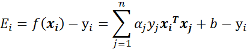]

②：计算上下界L和H：

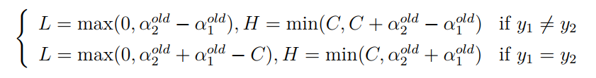

③：计算$\eta$

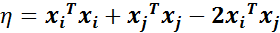

④：更新$\alpha_j$

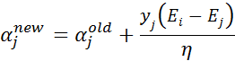

⑤：根据取值范围修剪$\alpha_j$

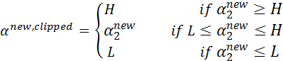

⑥：更新$\alpha_i$

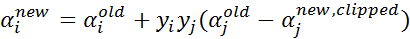

⑦：更新$b_1,b_2$

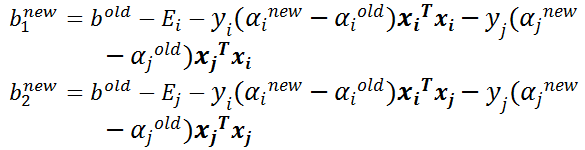

⑧：根据$b_1，b_2$更新b

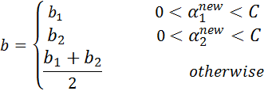


### 程序框架

哎，我感觉SVM最基础的东西的体量明显比优化要更有挑战性啊。。附上这个[博客](https://cuijiahua.com/blog/2017/11/ml_9_svm_2.html)，做了一点优化。选择最大的$\eta$，能使$\alpha$的迭代更快。

然后也加了个核函数，脑壳疼。

至于框架，不写了。代码实现不比数学原理的排列难多少。难死我了。

### 结果评估

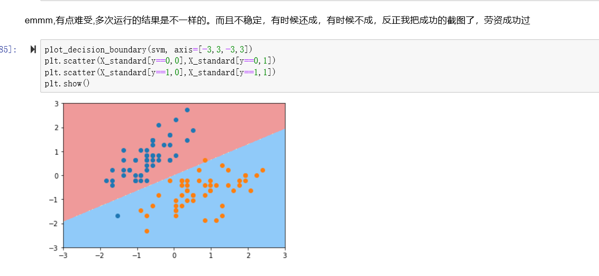

我做的SVM是不稳定的，所以就只能先截个图了，现在这个还是可以的，至于SVM的应该莫得问题。太难了。