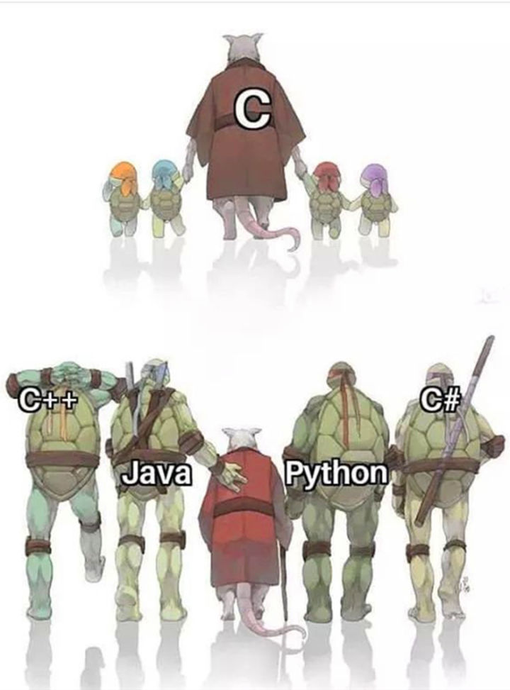

# QG训练营数据挖掘组第三周周记：

2020年4月12日

## 生活随记

我，今天又去看了一下那个表，突然间发现周记是有字数下限的。

哦豁，完蛋。

我把过去两周，tv做的笔记也发上来吧。当作弥补，就肯定是莫得什么文学性的了~~如果数学美也是文学美的话那倒算有嘻嘻嘻~~

随记？挠头，其实这段时间我有个我觉得很重要的变化，我开始觉得机器学习是很有意思的事情了。在这之前，我的学习的态度的积极多少有些水分，相比于积极更像是一种盲目的自觉。对编程并没有感觉，绝对谈不上喜欢（现在尤其地不喜欢C语言这只小妖精非法内存访问真的是苦我久矣）只是自己在高数和线代的理解中瞎浪，逛着逛那的。emmm，这是一种很奢侈的任性吧。

但是看训练群里的大佬C语言讨论的东西一个比一个秀，我连做个什么小事情有时候都拿捏不准，要新建一个文件test一下或者疯狂CSDN，就更觉得自己任性了。当时能不这么瞎浪就好了，搞得现在C语言满地狗刨。

不过当时也应该不会想着去深钻C语言，因为当时对它莫的感情（我再强调一遍现在也莫得，我是莫的感情的树蛙）。现在会觉得高数电工大物没意思，想到可以搓搓机器学习眼睛就放光，虽然不总是会这样。

哎，我不是~~其实就是~~厚此薄彼的人，讲道理多元微积分也是很有意思的，特别是用线性代数~~线代nb！（破音）~~的观点审视所谓的以直代曲，所谓的高低维度之间的投影和嵌入balabala，哎~~草~~，太美了。

哎，什么时候能对C语言有这样的感情就好了。

哎！我前段时间看到了一张超级暖心的图片，让我觉得哇超级好的。

## 存在问题

C语言，太菜了。

跟着学校走的时候觉得很多东西都很蠢，就知道了个大概，或者知道应该怎么做出来。于是在具体实操的时候这卡那卡的，相信会好的吧，毕竟现在有训练的语境了（盲目乐观）

## 下周规划

topview的工作考核怎么着也要交一下了，然后看看有没有时间捡一下爬虫吧。

