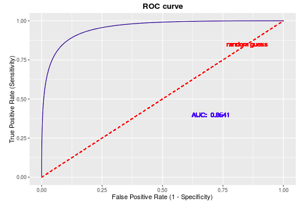
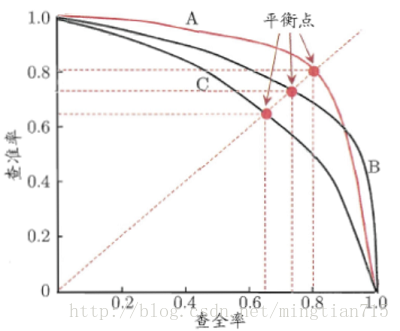

<center>模型评估</center>

[TOC]


# 先摸一下

如标题，之前没有了解过这方面的知识，那先简单的摸一下( •̀ ω •́ )✧，然后再考虑编写，乃至进一步的模块整合。

## 数据集划分

机器学习的目的是发现样本的一般规律。

那我们理想的方案就是对多个候选模型（这些模型的训练误差已经比较小了）进行泛化误差的评估，然后再选择泛化误差最小的模型。

评估有不同的方式，但是都要切分数据集啊。

### 留出法

将数据集D划分为两个互斥的集合，训练集S（占比$\frac{2}{3}$~$\frac{4}{5}$），剩余的用于测试，测试数据就是测试集了，训练数据其实还可以划分为训练集和验证集。

### 交叉验证法

将数据集划分为K个大小相似的互斥子集，每个子集都尽可能保持数据分布一致。每次用K-1个做训练集，剩下的子集做测试集，进行K次训练和测试，取K个测试结果的均值。K最常见的是取10。

###自助法

留出法和交叉验证法保留部分样本用于测试，实际模型的训练集比D小，会因为训练样本大小不同，引入估计偏差。而自助法强调的是有放回的进行抽样，是样本和数据集等大。

样本在m次采样中始终不被采到的概率为$(1-\frac{1}{m})^m$，取极限值的话大概就是$\frac{1}{e}$，就0.368,也就是说大概有36.8%的样本未出现在采样数据集中，也用于测试。

优点就是训练集和数据集等大咯，有三分之一可以用于测试，从初始数据集中产生不同的训练集，对集成学习等方法有很大的好处。

使用场景是数据集较小，难以有效话分训练/测试集的时候，在数据充足的情况下，留出法和交叉验证法更常用一些。

## 评估

**概述：**我们需要科学的评估手段来衡量做出来的模型的效果，我们已经有了一些基础的评价指标了，比如说衡量预测值与实际值差距的偏差，衡量预测值之间分散程度的方差等等。但是这还远远不够，因为我们的模型的功能不同，我们也要根据模型设计衡量的标准。

这里的模型有两类，一类是分类评估，这也是下面重点记录的。另一类回归评估其实原理都很直观，就随便记一下。

***

混淆矩阵是封装数据预测结果的矩阵，对于k元分类，它就会是一个k乘k的表格。

我们会有很多的评价指标，因为很显然，或者等一下就很显然的，只有一个衡量标准是不够说明问题的，模型某些指标很好和另一些指标很差不是不会发生的事情。但是不用慌张，只要你的数学嗅觉灵敏一点，公式所想表达的意思，都是很直观很有道理的，不用慌。

所以我们用混淆矩阵把数据封装起来，用它来综合地判断分类器的分类效果。起到模型评估的作用。

#### 混淆矩阵初探

呐，我们先拿最简单的二元分类举例子。因为这个时候的混淆矩阵是最简单的。

|                            | Relevant（相关）              | NonRelevant（不相关）         |
| -------------------------- | ----------------------------- | ----------------------------- |
| Retrieved（被检索到）      | true positives （TP）正确判定 | false positives（FP）错误判定 |
| NotRetrieved（未被检索到） | false negatives（FN）漏判     | true negatives （TN）正确判定 |

#### 基础分类评价指标

我们通过这个例子，来介绍一下召回率，准确率和精确率，我尽量表述出我对它们的直观印象，并且指出它们的局限性。由此来引出下面的概念。因为例子本身就是分类的评估，所以有一部分觉得比较顺就继续往下记了，那这些东西放在分类评估的标题下也是合理的。

**给个例子：**

```
假如某个班级有男生80人,女生20人,共计100人.目标是找出所有女生.
现在某人挑选出50个人,其中20人是女生,另外还错误的把30个男生也当作女生挑选出来了.那剩下的50人他就判定成功了，他知道他们是男的。

作为评估者的你需要来评估(evaluation)下他的工作
```

首先我们可以先来瞅瞅**召回率(recall)**(因为它的数值最高( •̀ ω •́ )✧。),好像也有些人叫它灵敏度，它想衡量的是分类器对正例的识别能力。

就是$\frac{TP}{TP+FN}$啦！它是是“正确被检索”占“应该被检索到”的比例，大白话就是“找不找得全”。模型的召回率是$100\%$，因为所有的女生都被召回了，就算把所有的人都识别为女生，召回率也是$100\%$。是不是开始嗅到一点只有一个衡量标准的不靠谱了？此外，与之对应的还有衡量分类器对负例的识别能力，类比就好。


那我们再来看一下**准确率(accuracy)**好了，在数学中的概念是它和真实值之间的差距。

即$\frac{TP+TN}{TP + FN + FP + TN}$。就是它识别出来且正确判定的数量与样本总数量的比值，大白话就是“找不找得对”。那这个比值想当然的是越高越好嘛，很直观。你看这个例子，准确率就是$70\%$。与准确率相对应的一个概念就是错误率，计算方式可以是1-accuracy，就提一下。因为我们马上就要把这个概念给打倒了(ノ｀Д)ノ

尽管这个指标看上去是多么的简单好用，它有很大的问题。如果——不同样本的比例非常不均衡，占大比例的类别往往会成为影响准确率的主要原因：比如，上面如果有100个人，95个男生，5个女生，即使你全部识别为男生，准确率也是95%，那就是说你这个憨憨连一个漂亮小姐姐一个都没有识别出来，我痛心疾首地问你此时的准确率有什么用呢？你怕不是只能搞基了(/▽＼)

没有用的，地震探测仪可以每天预测大型地震发生的概率为0，就这么一年一年地预测下来，真要到发生那么一两次大型地震的时候，它不管有没有给人起到警示作用，都不会让它的准确率变得稍微低一点点，因为预测“成功”的基数太大了，但我们需要的是它能给我们正确地，提前地预警，而不是那么高的准确率。你比如要是预测地震，**或者是任何一个类别代表了极大多数的数据点的情况**——

那么召回率可能就更有意义，我上面也说了，它衡量的是分类器对正例的识别能力，如果模型预测大型地震的召回率是百分之百，那多好啊。不过这又回到召回率的问题，我要是天天预测发生大型地震，那我的召回率肯定也是百分百。所以这实际上是一体两面的事情。


那有没有更加严厉一点的衡量标准来批判这个模型呢，看看**精确率(prcision)**叭！在数学中的概念就是整个数据之间的方差。

这个公式是$\frac{TP}{TP+FP}$，计算的是“正确被检索”占“实际被检索到”的比例。FP就是被误判的嘛，在上面那个例子中FP就是那30个被误判为女生的男生，此时模型的精确率是$40\%$。就很低了，在实际情况下出现这种数值，就可以引起我们的警觉。

不过这个指标越高其实也只是说明预测的结果越整齐，方差越小罢了。也有它的局限性，而且例子中的20个女生，假设我识别出来了10个女生，剩下的不管男的女的我都没有识别出来。那我的精确率也是$100\%$噢，精确，但是不全面，这个时候准确率给这个模型的脸色就十分的难看了。


#### 进一步的分类评估

你看，召回率和精确率很容易发生矛盾，在某些情况中，我们也许需要以牺牲另一个指标为代价来最大化精度或者召回率。例如，我们想找到所有飞机上的恐怖分子，召回率越高越好。如果随访检查的代价不是很高，我们可以接受较低的精度。虽然把飞机上的所有人都定为恐怖分子这种代价肯定是很高的啦。但是给用户推送他们可能喜欢的视频或者

然而，如果我们想要找到精度和召回率的最佳组合，我们可以试着把他们揉在一起，甚至进一步的，我们想要全面一点的挖掘出这些数据的价值，从而引出下面各种各样的指标。

##### F1_score

emmm，其实揉在一起的话，那就是取平均咯？算术平均这种做法是不太可的，你比如说召回率给模型打100分，准确率给模型打0分，那这个模型应该打多少分呢？我会倾向于打0分，因为这种模型做出来很有可能是毫无意义的，但是算术平均会给出一个50分，实在是太不能惩罚这个模型的随意了，我们不要用算术平均，用调和平均。

调和平均整体上会低于算术平均，这是调和平均的特性。而且只要一个值特别小，调和平均也会特别的小，这个很小的值，就说明这个模型是仅有那么一点点微小的，可怜的可信度。它能狠狠地惩罚极端情况。

$F_1-score=\frac{2xy}{x+y}$，其中x是精确率，y是召回率

##### F-score的推广

呐，我们已经很简单地把精准率和召回率都结合起来了。为什么说”简单“呢，因为这个念头是简单的。就是想得到一个精准率和召回率结合起来的念头，而且结合的方式也是很简单的，在F1-score中，精准率和召回率都是一样重要的，那在特定的情况下，我们想要我们的评价指标更加偏向于精确率，或者召回率的话，可以在原有的基础上稍微修改一下，加大或者减小某一方的权重，使得评价指标对特定的一方更加敏感。

$F_\beta-score=(1+\beta^2)\frac{2xy}{\beta^2x+y}$, again,x是精确率，y是召回率。

$\beta$的数值的选择是经验性的，当我们认为精确率更重要些的时候，那就调整*β*的值小于1，如果我们认为召回率更重要些，那就调整*β*的值大于1。至于具体值的选择，那就是直觉的艺术了。

##### ROC和AOC

下面这一段是摘自知乎[Simpleton](https://www.zhihu.com/question/30643044/answer/562062736)（自己还有点小微调）的，十分感谢他！

以上介绍的度量标准都是在已经做出分类的前提下，也就是说目标已经被成功分好类，例如患病/未患病，这种直接给出分类结果的分类器叫做硬分类(Hard Classification).

但很多算法，是先根据所有特征算出一个“评分”，然后根据这个“评分”，依靠一个阈值进行分类。比如做流行病检测时，会先根据一些被检测者特征算一个分数，比如体温越高分数越高，具有咳嗽表现分数越高等等，然后再将这些分数依照某一个阈值进行分类。最后选择出一个最好的阈值，也就确定了这个模型的应该配置什么样的参数。ROC是这么做的，下面的PR也是如此，这是一种全新的，独立的训练模型的方式。

这样还能引出一个小启示，某一个点处的数值是不能全面的衡量模型的性能的，只有通过P-R曲线的整体表现，才能盖棺定论。

****

**插播一下笔者的话：**

如果你像我一样，之前看了吴恩达老师的视频或者之类的，它们可能在选定好一个模型之后，直接就用相应的代价函数把模型给训练好了。我一开始还很奇怪，训练好的模型还要用ROC来评估吗？如果你也有这样的疑惑，请往下看，你就会知道ROC或者PR起到的，其实也是代价函数的作用。它们都在从头开始训练模型。

***

例如，机器学习中很常用的一个算法逻辑回归(Logistic Regression)，就可以先对所有特征进行线性评分，然后通过Sigmoid函数把目标值转化到0~1之间，把它当作概率。再选择一个阈值，就是将这个连续值切断，进行硬分类。

**所以具体的类别，实际上非常取决于这个阈值**，假如你选择的阈值很低，则被分成正类(Positive)的样本数会非常多，所以以反之如果你选择的阈值很高，则被分类成负类(Negative)的样本数会比较多。

|                            | Relevant（相关）              | NonRelevant（不相关）         |
| -------------------------- | ----------------------------- | ----------------------------- |
| Retrieved（被检索到）      | true positives （TP）正确判定 | false positives（FP）错误判定 |
| NotRetrieved（未被检索到） | false negatives（FN）漏判     | true negatives （TN）正确判定 |

当我们以**假正例率**，即FPR为横坐标，**真正例率**，即TPR为纵坐标——

$TPR=\frac{TP}{TP+FN}$					$FPR=\frac{FP}{FP+TN}$

而这样一个通过调整阈值，反映TPR和FPR同向变动的曲线就是ROC曲线。曲线下与x轴之间的面积就是AUC。AUC实际上反应了这个模型的优劣程度。

可以根据ROC曲线调整阈值，选择希望得到的TPR与FPR的组合，然后在这个组合上看其混淆矩阵进行分析。ROC本质上是不同阈值下硬分类的多种集合，给了分析者更多灵活选择的空间。我们就是挑选出一个合适的阈值，才确定最后的模型。



如果这个直线长得跟y=x差不多的话，那几乎是废的。因为这意味着它把样本预测为正的概率和预测为负的概率是一样的，那抛硬币就好啦，为什么还要训练样本呢？所以对角线也叫做纯机遇线。也就是因为这个原因，AOC，也就是曲线的面积，一般是大于0.5的。如果小于0.5的话，你把你的预测结果反过来就也大于0.5了。

此外，由于用来瞄点绘图的数据没有那么多，真实的ROC图像会和上面是有差别的，但是大体的原理是差不多的。

最后，再用和逻辑蒂斯回归一样的方法，把它上升到可以多分类的程度。其实就是构造多个分类器而已,把待识别的类划分在一边，剩下的其他类话分在另一边。然后就转变成“二分类”，也就是上面的情况了。

[链接](https://www.cnblogs.com/massquantity/p/8592091.html)

##### PR曲线

上面已经说了召回率和精确率在实操的时候是有可能发生矛盾的，以横轴为召回率，纵轴为精确率。做出来的曲线就是PR曲线，就可以从图的角度来看，他们是怎么相互矛盾的，并且，还可以得到一些新的指导。这个图是从[这里](https://blog.csdn.net/mingtian715/article/details/53488094?depth_1-utm_source=distribute.pc_relevant.none-task&utm_source=distribute.pc_relevant.none-task)得到的，感谢博主。



最理想的模型当然应该是召回率和精确率都是1，就算达不到，也是越高越好，所以啊，当我们发现某个模型的P-R曲线的包成的面积更大，那么我们就认为它更优秀。

***

#### 回归评估

##### 四个指标

我们以前做的大多数情况是”已知符合线性回归，求出直线”，换句话说我们不需要判断拟合出来的直线拟合得够不够好，因为我们“已知它符合线性回归了”。但实际上我们可能并不知道它是不是符合线性回归，那我们就需要一个标准来衡量训练出来的线性模型的泛化能力了。

就还是用训练数据训练出来模型，然后用测试数据检测就好。

其实也没什么复杂的，下面是几种衡量标准。这几种标准sklearn都有，但我们也可以自己搓一下~~就是要我们自己搓啊~~

**MSE**：Mean Squared Error

${\dfrac{\sum\limits_{i=1}^m(y^{(i)}_{test}-\hat{y}_{test})^2}{m}}$就是均方误差，还有均方根误差即**RMSE**。都差不多。但是后者的有时候在量纲上的统一可能会使得这个数据更有解释性，单位上的对应能让你很方便的说出来数据的误差大概在什么范围。

**MAE:**Mean Absolute Error

${\dfrac{\sum\limits_{i=1}^m|y^{(i)}_{test}-\hat{y}^{(i)}_{test}|}{m}}$这是其他的指标，我们没有在代价函数的计算中使用它有一个原因是，这个绝对值函数不是处处可导的，可能会不方便我们求极值。但是这不影响我们用它来做评价指标对不对(╹ڡ╹ )。

此外还有一个小点就是，MAE和RMSE相比，**后者**的数值成分更大程度上被误差最大的那一项决定，而MAE就只是一个累加而已，所以要做什么梯度下降之类的操作的话，RMSE的意义可能更大一些。

**MAPE**:Mean absolute percentage error

${\dfrac{\sum\limits_{i=1}^m|y^{(i)}_{test}-\hat{y}^{(i)}_{test}|}{y^{(i)}}}*\dfrac{100}{m}$

范围[0,+∞)，MAPE 为0%表示完美模型，MAPE 大于 100 %则表示劣质模型。


***

##### $R^2$

上面这三个指标都仍有进步的空间。

分类问题的预测就是一个概率，不管在什么示例里面都是0~1之间的一个数。但是无论用上面的哪种指标，你在衡量房价预测准确度的时候可能单位是万，在衡量学生成绩的时候可能就是更小的单位，比如说“分”了。这样如果我们希望**跨越不同示例**来比较模型的优略，我们就还需要一个新的指标。

R Squared（也可直接叫R方）我们有

$R^2=1-\dfrac{SS_{residual}}{SS_{total}}$emmm，其实它的计算式就是$R^2=1-\dfrac{\sum\limits_{i=1}(\hat{y}^{(i)}-{y}^{(i)})^2}{\sum\limits_{i=1}(\overline{y}-{y}^{(i)})^2}$。这个复杂的分子就是使用我们的模型预测产生的错误，这个分母是使用$y=\overline{y}$进行预测产生的错误。相比于朴素或者说无脑的分母预测方式，分子的预测方式是更加妥帖的，它最起码有考虑x和y的关系，所以可以想到分子产生的错误是比分母产生的错误要多的。也就是说，虽然它产生了一些错误，但是它也减少了一些错误。**拿1减去这个比值，那么就相当于是这个模型拟合准确了的数据的比例。**

如果这个$R^2$等于0，就说明我们的模型应该是基准模型，如果$R^2<0$，说明我们学习到的模型还不如基准模型，此时，**很有可能我们的数据不存在任何线性关系。**

# 开搓

### 绘制决策边界

我在网上嫖到了一个绘制决策边界的函数，现在学习如下。

```python
def plot_decision_boundary(model, axis):
    x0, x1 = np.meshgrid(
        np.linspace(axis[0], axis[1], int((axis[1] - axis[0]) * 100)).reshape(-1, 1),
        np.linspace(axis[2], axis[3], int((axis[3] - axis[2]) * 100)).reshape(-1, 1),
    )

    X_new = np.c_[x0.ravel(), x1.ravel()]
    y_predict = model.predict(X_new)
    zz = y_predict.reshape(x0.shape)
    from matplotlib.colors import ListedColormap
    custom_cmap = ListedColormap(['#EF9A9A', '#FFF59D', '#90CAF9'])
    plt.contourf(x0, x1, zz, linewidth=5, cmap=custom_cmap)
```

contour和contourf都是画三维等高线图的，不同点在于contourf会对等高线间的区域进行填充，所以在绘制决策边界的时候视觉效果会好一些。