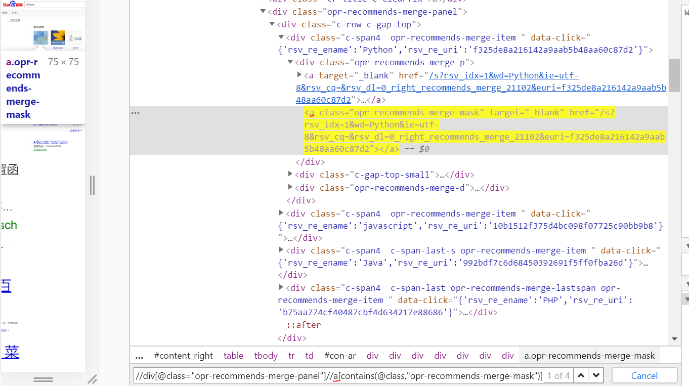

<center>爬取华晨宇</center>

首先是这三个东西的基本介绍啊，xpath,selenium和Beautifulsoup。根据经验先意思一下知道大概是个什么东西就开搞。

多线程什么的我就看看。

#先摸一摸


## XPath

XPath是用来解析XML的一种语言，广泛用于解析HTML的数据（HTML其实是XML的子级了la），而且几乎所有语言都能使用XPath，比如Java和C语言。除了XPath还有其他的手段可以用于XML的解析，比如我已经接触过一点的BeautifulSoup。

**XPath的语法**

然后再来大概的介绍一下XPath的语法，其实大的语法类别只有三类。

​	**·**层级：`/`是直接子级，`//`就是跳级

​	**·**属性：`@`进行属性访问

​	**·**函数：`contains()`,`text()`等

**举个例子**

浏览器的`ctrl+F`打开查找功能，就可以看到XPath的身影。


**对某个元素右键，然后点击检查，就能知道它在源代码中的位置。**这个小技巧对新手来说太重要了。可以消除很多恐慌2333

如果我想要用XPath进行查找的话，我用的就是这样一个语言/`/div[@class="opr-recommends-merge-panel"]`。


如果我还想再进一步的要里面的那个Python。我就还需要再用一串XPath，这里还用到了contains函数，因为这个class的内容太多了，我们用包含的函数就好。~~真的是搞死个人~~



XPath就这么多吧。


## selenium

这次这个东西是重点啊，挠头。

### 重点摸一摸

selnenium是自动化测试工具，用在python中就变成了帮助我们进行爬虫的工具了。它可以用代码对指定的浏览器进行操作，比如打开一个页面，获取搜索框，获取按钮点击什么的，下面给出一个小例子，可以照猫画虎试试。

```python
#导入web驱动模块
from selenium import webdriver
#创建一个Chrome驱动（这个驱动要自己安装设置）,这样就相当于我们有了Chrome浏览器了。
driver = webdrivwe.Chrome()
#使用get方法打开百度
driver.get("https://www.baidu.com")
#获取搜索框，然后往里面输入搜索内容
input = driver.find_element_by_css_selector("#kw")
input.send_keys("什么是selenium")
#获取搜索这个按钮，然后点击
button = driver.find_element_by_css_selector("#su")
button.click()
#就这样，我们就完成了一次自动的百度搜索。
time.sleep(5)
b.quit()
#这两个加上去后它会在页面暂留一下，然后就会自动关闭浏览器，如果是.close()，关闭的就是该页面。
```

按理说我应该把成功的效果截取下来看一下的233，但是看到界面在动我就不想动了hhhh，挺酷炫的，成功了的(●'◡'●)

```python
# 或者我们可以这个样子
driver = webdrivwe.Chrome()
driver.get("https://www.baidu.com")

# 输入
driver.find_element_by_id('kw').send_keys('你想搜索的东西')
# 点击
driver.find_element_by_id('su').click()
```

我们选定搜索框，然后鼠标右键点击检查**检查**就可以发现有这个东西，也就是‘kw’的来源。input有没有让你联想到搜索框？

同样，在选定”百度一下“进行检查的时候，我们会发现‘su‘。


最上面的**find_element_by_css_selector()**的其中一种使用方法就是用（#）来表示通过id属性来定位的元素。大体上，我虽然仍然不太清楚这个函数是怎么使用的，但是总不会看着那么慌。

### 定位我们想要找到的元素

通过selenium，我们可以简单定位元素和获取对应的数据，上面是根据**根据id属性值获取元素列表**，我们还有其他的方法。在找到我们想要的元素的标签后，右键找到**copy**，就有copy XPath的选项。

```python
find_elements_by_id # 根据id属性获取元素列表
find_elements_by_class_name # 根据类名获取元素列表
find_elements_by_xpath # 返回一个包含这个元素的列表
find_elements_by_link_text # 根据标签的文本获取元素列表，精确定位
find_elements_by_partial_link_text # 根据标签包含的文本获取元素列表，模糊定位
find_elements_by_tag_name # 根据标签名获取元素列表

#想要获取多个元素，就在element后面加个s就好了，会以list的形式返回
find_elements_by_name
```

### 获取价值信息

上面的方法都是用来定位元素的，而我们的目标是在定位之后获取该标签的有价值的信息。假设我们已经创建了指定的标签对象——

由于这次有要求获取视频的地址，顺手查了一下，HTML\<a>标签的href属性是用来干什么的，这个属性用于规定链接的目标。

`<a href="http://www.w3school.com.cn">W3School</a>`

如果想要获得这个属性值的话，我们可以用`get_attribute(‘href’)`来获取这个标签的href属性值。

此外，如果想获取\<h1>标签中包裹的文本内容，可以在用上面的方法创建特定的标签对象后，用.text方法获取文本内容。 


### 其他方法

#### 切换浏览器窗口

一个浏览器有多个窗口很正常叭，那不得学学？

```python
# 获取当前所有的窗口,如果你的浏览器有两个窗口，打印这个，它会返回给你有两个值的列表
current_windows = driver.window_handles

# 根据窗口索引进行切换，索引从0开始，按打开的先后顺序排序
driver.switch_to.window(current_windows[1])

# 前进与后退
driver.forward()
driver.back()
```


#### 进入嵌套网页（自动登录）

iframe是html中的一种常用技术，即一个页面中嵌套了另一个网页（比如说页面登陆），selenium默认是不访问frame中的内容的，要想访问它，就得用`driver.switch_to.frame()`参数是页面的索引值。

然后获取输入框，再用sent_keys(‘ ’)把账号和密码输入进去，再获取确认登陆之类的按钮，再click()一下就好。


#### 等待

代码运行速度和浏览器加载渲染速度**不是一个量级**的，所以各种毛病的出现着这个定位不到那个定位不到可能是没有加等待带来的毛病。也就是说我们要养成加[等待](https://blog.csdn.net/huilan_same/article/details/52544521)的好习惯( •̀ ω •́ )✧

等待方式有几种，像最上面就有一个sleep方法，但是**强制等待**是有点粗暴的，不管你是不是提前加载好，或者还没加载好，程序都会且只会掐着走。

比上面好一点的应该是**隐形等待**，即`implicitly_wait(xx)`，如果约定时间过了还没加载好会报错，但是提前加载好就可以进行下一步的操作了。

```python
from selenium import webdriver

driver = webdriver.Firefox()
# 隐性等待对整个driver的周期都起作用，所以只要设置一次即可
driver.implicitly_wait(30)  # 隐性等待，最长等30秒
driver.get('https://huilansame.github.io')

print driver.current_url
driver.quit()
```

注意这里有一个弊端，那就是程序会一直等待整个页面加载完成，有时候页面想要的元素早就在加载完成了，但是因为个别js之类的东西特别慢，我仍得等到页面全部完成才能执行下一步。

最体贴的方式应该是检测我们想要的元素，那个元素加载好了之后就可以进行下一步操作了。而这个就是**显性等待**。即`WebDriverWait`。配合这个类的until()和until_not()，就可以根据判断条件灵活地设置等待了。它主要的意思就是：程序每隔xx秒看一眼，如果条件成立了，则执行下一步，否则继续等待，直到超过设置的最长时间，然后抛出TimeoutException。

再先看看：

```python
from selenium import webdriver
from selenium.webdriver.support.wait import WebDriverWait
from selenium.webdriver.support import expected_conditions as EC
from selenium.webdriver.common.by import By

driver = webdriver.Firefox()
driver.implicitly_wait(10)  # 隐性等待和显性等待可以同时用，但要注意：等待的最长时间取两者之中的大者
driver.get('https://huilansame.github.io')
locator = (By.LINK_TEXT, 'CSDN')

try:
    WebDriverWait(driver, 20, 0.5).until(EC.presence_of_element_located(locator))
    print driver.find_element_by_link_text('CSDN').get_attribute('href')
finally:
    driver.close()
```

对上面这块码涉及的类和模块做一点简单的补充。

对于webDriverwait这个显性等待类，有这些参数和方法：

##### webDriverwait

**参数：**

```
__init__：
driver: 传入WebDriver实例，即我们上例中的driver
timeout: 超时时间，等待的最长时间（同时要考虑隐性等待时间）
poll_frequency: 调用until或until_not中的方法的间隔时间，默认是0.5秒
ignored_exceptions: 忽略的异常，如果在调用until或until_not的过程中抛出这个元组中的异常，则不中断代码，继续等待，如果抛出的是这个元组外的异常，则中断代码，抛出异常。默认只有NoSuchElementException
```

**方法：**

```
# until：
method: 在等待期间，每隔一段时间（__init__中的poll_frequency）调用这个传入的方法，直到返回值不是False
message: 如果超时，抛出TimeoutException，将message传入异常

# until_not:
 与until相反，until是当某元素出现或什么条件成立则继续执行，
 until_not是当某元素消失或什么条件不成立则继续执行，参数也相同
```

这个类的调用方法可以是这个样子`WebDriverWait(driver, 超时时长, 调用频率, 忽略异常).until(可执行方法, 超时时返回的信息)`

但是这里需要注意until的第一个参数，下面看一下错误的案例。

```
# 错误案例
WebDriverWait(driver, 10).until(driver.find_element_by_id('kw'))
# 这里的参数一定要是可以调用的，即这个对象一定有 __call__() 方法，否则会抛出异常：TypeError: 'xxx' object is not callable
```

菜鸡我其实看不懂这里的原因是怎么回事，但是我觉着until后的第一个参数应该是一个判断条件。**expeced_conditions**模块的用法也”佐证“了我的感觉。

##### expeced_conditions

expected_conditions是selenium的一个模块，其中包含一系列可用于判断的条件。

用验证title的方法，检验元素是否可见的方法，判断某段文本是否出现在某元素中的方法，不尽而语。

也有验证元素是否出现的方法，这个时候传入的参数都是元组类型的locator（定位器），如（By.ID,’kw‘）。


## BeautifulSoup

Beautiful Soup 也是一个HTML/XML的解析器，主要的功能也是如何解析和提取 HTML/XML 数据。因为之前有相对详细的笔记，这里就不记了。


# 尝试

要求是：

爬取b站中蔡徐坤相关的视频（5页）内容包括：名称 视频地址、描述（简介）、观看次数、弹幕数量、发布时间,并导入到csv中。因为知道了检查功能，再对比小帅b的图片，比较方便的找到了所要爬取的数据在源代码中的位置。

但我选择爬取华晨宇，哼唧。

但是我们要用selenium实现的哦…selenium的实现和爬取是交织在一起的，这个就有点麻烦。

这个是框架——

```python
# 部分的准备工作
browser = webdriver.Chrome()  # 获取浏览器对象
WAIT = WebDriverWait(browser, 10)  # 指定最长等待时间
url = 'https://www.bilibili.com'
print('开始访问b站……')
browser.get(url)

def main():
    try:
        search('华晨宇')
        htmls = crawl()
        items = parse(htmls)
        save_to_csv(items)

    finally:
        print('爬取信息成功！')
        browser.close()

if __name__ == '__main__':
    main()
```


**search()函数**是用selenium实现把我们要搜索的东西放在搜索框里，然后点击搜索按钮。

```python
def search(content):
    print('正在进行搜索……')
    # 选定搜索框对象
    input = WAIT.until(EC.presence_of_element_located((By.XPATH, '//*[@id="nav_searchform"]/input')))
    # 选定搜索按钮对象
    submit = WAIT.until(EC.element_to_be_clickable((By.XPATH, '//*[@id="nav_searchform"]/div/button')))
    # 把要搜索的信息填入搜索框
    input.send_keys(content)
    # 点击搜索按钮
    submit.click()
```


因为我们要爬取5页的信息，所以我们需要一个列表存储好这5个html——方便我们接下来对每个html进行爬取。这就是crawl函数做的事情。

```python
def crawl():
    htmls = []  # 存放每个页面的HTML
    # 用for循环爬取每一个页面并获得其HTML
    for i in range(5):
        # 用f+字符串来表示每一个页面的网址
        url = f"https://search.bilibili.com/all?keyword=%E5%8D%8E%E6%99%A8%E5%AE%87&from_source=nav_search_new&page={str(int(i + 1))}"
        r = requests.get(url)  # 返回Response对象
        if r.status_code != 200:  # 状态码检测
            raise Exception("error")
        htmls.append(r.text)  # r.text是字符串类型
    return htmls
```


接下来就是从标签树中获取信息了，用beautifulsoup解析，然后获取每个视频的标签树，再从这个标签树中摘取我们想要的信息。

```python
def parse(htmls):
    videos = []  # 存放每个视频解析出来的HTML
    print('解析页面中……')
    for html in htmls:
        soup = BeautifulSoup(html, 'html.parser')  # 解析每个页面
        # 获取每个视频的标签树
        video = soup.find(class_="video-list clearfix").find_all(class_="video-item matrix")
        videos.extend(video)  # 列表存入列表，所以用extend()函数
    items = []  # 存放每个视频的各个项目
    print('正在爬取相关信息……')

    for video in videos:
        item = {}  # 每个字典存放每个视频的相关信息
        item['视频标题'] = video.find('a')['title']  # 获取标签属性
        item['视频地址'] = video.find('a')['href']
        item['简介'] = video.find(class_='des hide').string  # 获取NavigableString
        item['观看次数'] = video.find(class_='so-icon watch-num').get_text()  # 获取目标路径下的子孙字符串
        item['发布时间'] = video.find(class_='so-icon time').get_text()
        item['弹幕数量'] = video.find(class_='so-icon hide').get_text()
        items.append(item)  # 字典存入列表，所以用append()函数

    return items
```


最后将其保存为csv文件

```python
def save_to_csv(items):
    print('成功将数据写入文件！')
    # 将爬取的数据写入csv文件
    df = pd.DataFrame(items)  # 用DataFrame构造数据框
    df.to_csv("华晨宇.csv")
```


```python
find_element_by_id
find_element_by_name
find_element_by_xpath
find_element_by_link_text
find_element_by_partial_link_text
find_element_by_tag_name
find_element_by_class_name
find_element_by_css_selector
```

如果我们打开了HTML，这个页面大概长这个样子的话——

```python
<html>
<body>
 <form id="loginForm">
  <input name="username" type="text" />
  <input name="password" type="password" />
  <input class="login" name="continue" type="submit" value="Login" />
 </form>
</body>
<html>
```

我们可以通过id获取form表单

`login_form = driver.find_element_by_id('loginForm')`

或者通过xpath也可，

```python
login_form = driver.find_element_by_xpath("/html/body/form[1]")
login_form = driver.find_element_by_xpath("//form[1]")
login_form = driver.find_element_by_xpath("//form[@id='loginForm']")
```

通过 name 获取相应的输入框

```python
username = driver.find_element_by_name('username')
password = driver.find_element_by_name('password')
```

或者通过标签也可，`input1 = driver.find_element_by_tag_name('input')`

通过class可以获取相应的元素。`login = driver.find_element_by_class_name('login')`

如果你觉得`driver.find_element_by_xxx`太长了，`driver.find_elements(By.ID, 'xxx')`看上去就好看一些，By.属性和上面的是一样的，虽然差不多，但好歹对称一些。

```python
ID = "id"
XPATH = "xpath"
LINK_TEXT = "link text"
PARTIAL_LINK_TEXT = "partial link text"
NAME = "name"
TAG_NAME = "tag name"
CLASS_NAME = "class name"
CSS_SELECTOR = "css selector"
```

